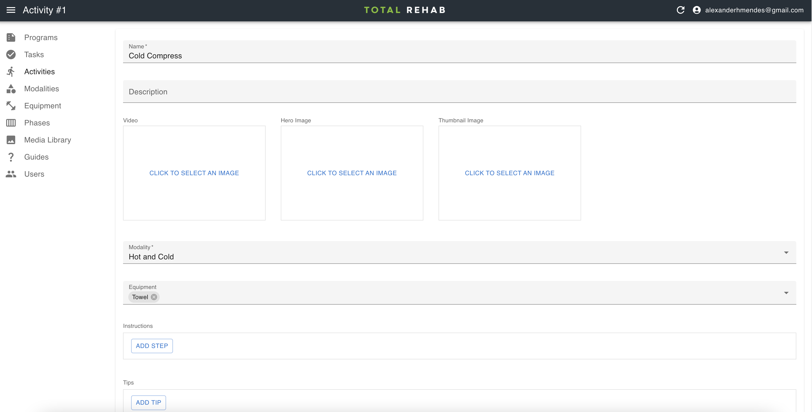

# Activities

Activities are the exercises or stretches used to build up a program.

## Creating activities

To create an activity select **Activities** from the sidebar, click **Create**,
fill in the form and hit **Save**.

### Media

A video for each activity is preferred. However, if one is unavailable it is
possible to use a hero image instead.

The thumbnail image will be used anywhere where we show a list of activities
(or modalities containing those activities).

### Instructions and tips

The optional instructions and tips fields can be used to provide additional
information to a user, which will be presented with each [task](./tasks.md)
associated with the activity.
