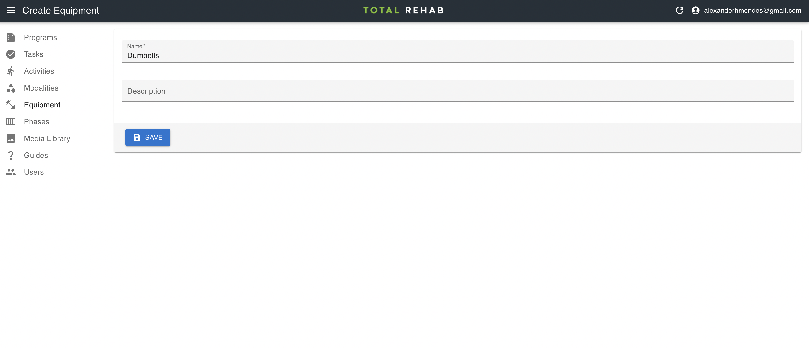

# Equipment

Any equipment required for each [activity](./activities.md) will be presented
users as they progress through their programs.

## Creating equipment

To create equipment select **Equipment** from the sidebar, click **Create**, fill
in the form and hit **Save**.

:::note
Do not use "None" or "Non-required" etc. as the name of an item of equipment.
This will be inferred automatically by not selecting any equipment when
creating an activity.
:::
