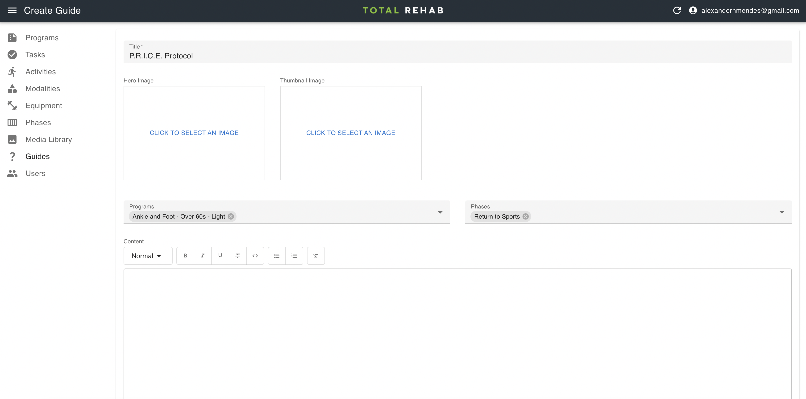

# Guides

Guides are presented on the schedule screen and used to provide additional
information to the user as they work through their program. Each guide can be
attached to one or more [programs](./programs.md), [phases](./phases.md), or
some combination of the two.

## Creating guides

To create a guide select **Guides** from the sidebar, click **Create**, fill
in the form and hit **Save**.

### Programs and phases

Let's say you wanted to write a guide about the P.R.I.C.E protocol and attach it
to the "Swelling and Support" phase of all programs. In this case you would
write your guide, select the "Swelling and Support" phase from the **Phases**
dropdown and leave the **Programs** dropdown empty.

If you wanted the guide to appear only on particular programs you would select
those programs from the **Programs** dropdown.

Both the programs and phases dropdown accept multiple values, so you could have
the same guide appear across two phases of two programs, for example, or any
other combination.

:::tip
At least one program or phase must be selected for the guide to appear within
the app.
:::
