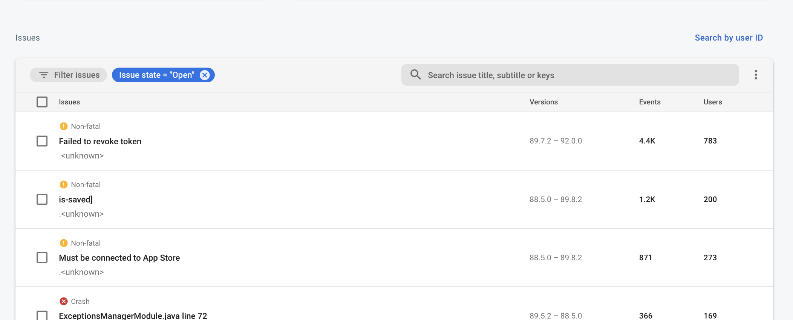

# Logging

We use a variety of tools for error and performance monitoring across the platform.

## Mobile app

Logs for the mobile app are pushed to
[Firebase Crashalytics](https://firebase.google.com/products/crashlytics).

To search Firebase logs by user GUID go to the
[Crashalytics](https://console.firebase.google.com/u/0/project/total-rehab-93423/crashlytics) page, select
the relevant platform and click the **Search by user ID** button:

## API

Logs for the API are pushed to [Sentry](https://sentry.io/).
