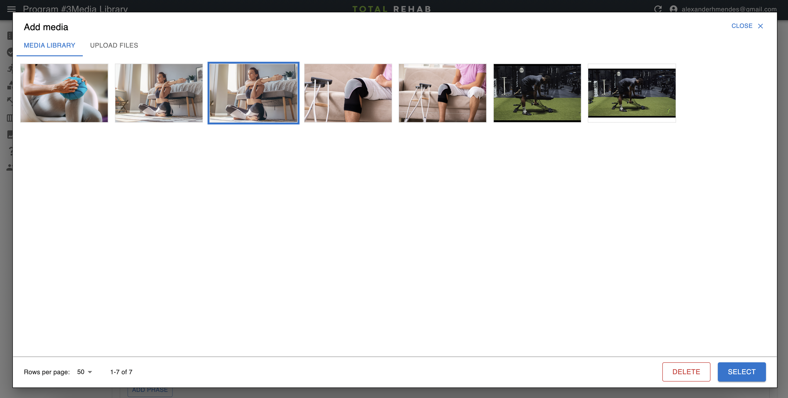

# Media Library

The media library lets you manage your images and videos and attach them to
various posts, such as [programs](./programs.md), [guides](./guides.md) and
[activities](./activities).

## Selecting media

To select an image or video that has already been uploaded click on the item,
then click the **Select** button.

## Uploading media

To upload a new image or video click the **Upload media** tab and select your
file. If uploading an image you will be given the opportunity to crop it before
hitting the **Save** button.

## Editing media details

If you want to edit the title of the image you can do so via the **Media Library**
section in the sidebar. This title currently serves as the
[accessibilityLabel](https://developer.apple.com/documentation/objectivec/nsobject/1615181-accessibilitylabel)
within the app, so should describe the image in at least a somewhat meaningful way.

## Deleting media

To delete an image or video either visit the **Media Library** section in the
sidebar, click through to the item, then click the **Delete** button. Alternatively,
you can delete items via the modal when creating or editing a post.

## Optimisation

Images are cropped and compressed in the browser, before being uploaded to
[Supabase storage](https://supabase.com/docs/guides/storage). This means that
you may see various crops of the same original image in the media library.

:::note
An alternative approach would be to store the full image data and use an
image resizing service to resize images on-the-fly, which would enable even
greater levels of flexibility but comes with the cost of running, or paying for
such such a service.
:::
