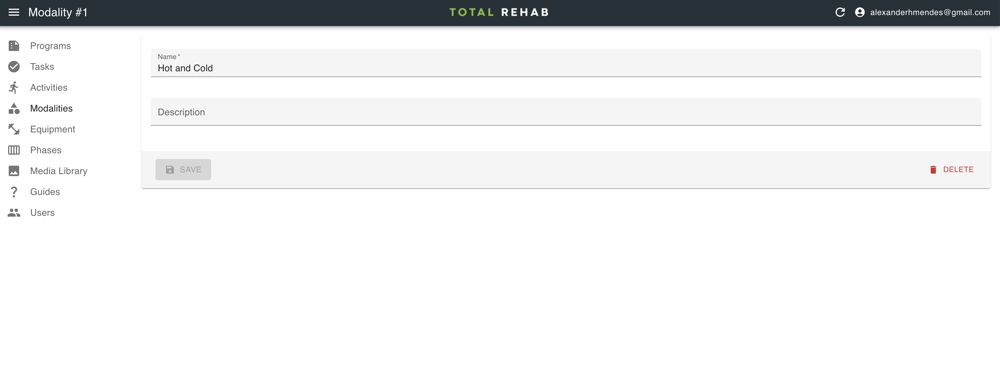

# Modalities

Modalities are used to group [activities](./activities.md). As users progress
through their programs they select a modality, after which they are presented
with all activities within that modality for which a [task](./tasks.md) has
been created.

## Creating modalities

To create modalities select **Modalities** from the sidebar, click **Create**, fill
in the form and hit **Save**.
