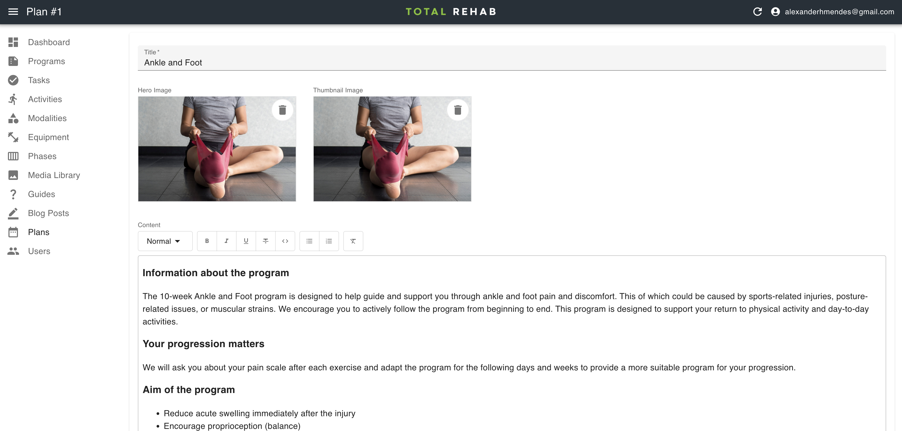

# Plans

Plans are generic representations of [programs](./programs.md) used for the
public-facing website only.

## Creating plans

To create modalities select **Plans** from the sidebar, click **Create**, fill
in the form and hit **Save**.
