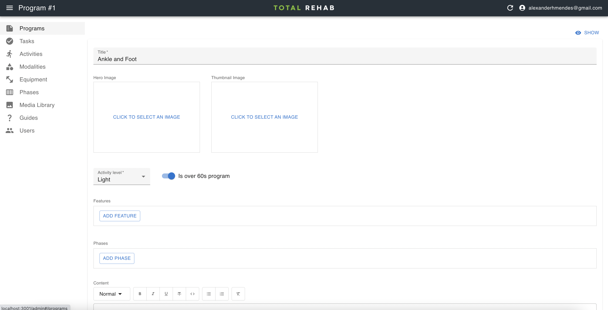

# Programs

Programs are assigned to, or selected by users. For each program we specify
the activity level it is suitable for and whether or not it is intended for users
over 60.

## Creating programs

To create a program select **Programs** from the sidebar, click **Create**, fill
in the form and hit **Save**.

## Publishing

As designing programs takes time and because we might not want to show incomplete
programs in the app all new programs are set to draft mode by default, meaning
that they will not show up in the app.

To make a program appear in the app select it from the list, toggle it
to **Published** and hit **Save**.

:::note
Remember to publish all variants of the program (e.g. over 60s light,
over 60s moderate etc.)
:::
