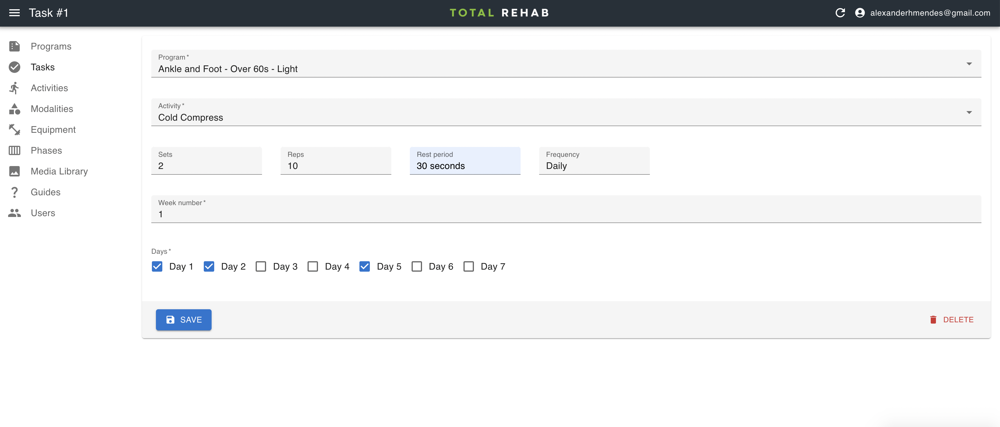

# Tasks

A program is ultimately built up from tasks, which are organised by week and day.

## Creating tasks

To create a task select **Tasks** from the sidebar, click **Create**, fill
in the form and hit **Save**.

Alternatively, you can click the **Bulk Create** button, which takes you to a
page where you can more easily insert multiple tasks for a program.

### Weeks and days

Tasks are organised by week and day, where "Day 1" is based on when the user
started a program, rather than a specific day of the week.

:::note
Programs run linearly, according to the scheduled weeks and days. However, as
we cannot control when a user will actually choose to complete a set of tasks it
could be that they are still on "Week 1" several weeks into their program.
Effectively, a user will progress to the next day only after they have completed
one or more tasks for the previous day.
:::
